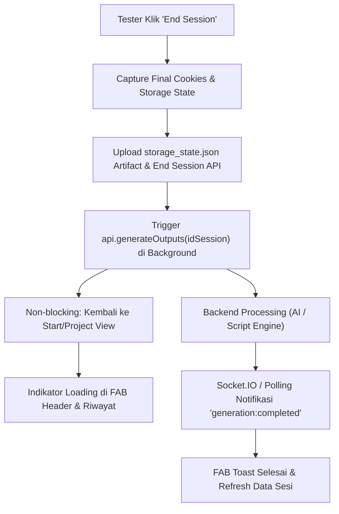

# PRD: Background Auto-Generation with Realtime Socket, Storage State Capture, & High-Fidelity Script Generation

**Slug:** `auto-generation-socket-and-state-capture`  
**Status:** `done`  
**Target:** Chrome Extension & QA API  

---

## 1. Background & Problem Statement

Sebelumnya, setelah tester menyelesaikan sesi rekaman pengujian (*End Session*):
1. **Blocking/Manual Generation**: Tester harus menunggu atau secara manual menekan tombol "Generate Script". Hal ini memperlambat alur kerja QA karena tester tidak bisa langsung berpindah ke test case berikutnya selagi AI/backend memproses kode Playwright.
2. **Ketiadaan Browser State (Cookies & Storage)**: Ekstensi belum menangkap cookies (`chrome.cookies`), `localStorage`, dan `sessionStorage` dari domain yang diuji. Akibatnya, sesi tidak memiliki konteks otentikasi/token yang lengkap, sehingga skrip hasil generasi sering kali kekurangan setup state awal (misal token login atau preferensi state).
3. **Akurasi & Kelengkapan Aksi Script Playwright**: Perekaman aksi tester pada `actionCaptureScript.ts` masih terbatas pada event `click`, `change`, dan `keydown` parsial dengan sedikit metadata locator. Interaksi seperti input typing realtime, pemilihan opsi `<select>`, checkbox/radio, navigasi multi-halaman, dan checkpoint assertion belum terekam dengan fidelitas tinggi.

---

## 2. Tujuan & Scope

### A. Non-blocking Background Auto-Generation & Realtime Socket Indicator
- **Auto-Trigger**: Saat user menekan "Selesaikan & Simpan Sesi" (*End Session*), proses pembuatan script Playwright dan ringkasan Markdown langsung dipicu di background (`api.generateOutputs(idSession)`).
- **Non-blocking UX**: Tester langsung kembali ke UI normal (StartView / ProjectView / Riwayat) dan dapat langsung melanjutkan pekerjaan berikutnya tanpa terhalang.
- **Realtime Status**: Integrasi listener Socket.IO (`generation:completed`, `generation:failed`) atau fallback polling cerdas dengan indikator loading/spinner animasi di FAB header dan status badge di item Riwayat Sesi.
- **Toast Notifikasi**: Begitu generasi selesai di background, toast notifikasi sukses muncul ("Skrip Playwright berhasil digenerate") dan status sesi ter-refresh otomatis.

### B. Storage & Cookies State Capture
- **Dual-Snapshot (Initial & Final)**:
  - Ekstensi menangkap snapshot cookies (`chrome.cookies.getAll`), `localStorage`, dan `sessionStorage` saat perekaman dimulai (*Initial State*) dan saat perekaman berakhir (*Final State*).
- **Standar Playwright Artifact**:
  - Menyimpan data state dalam format standar `storageState.json` Playwright (`{ cookies: [...], origins: [{ origin, localStorage: [...] }] }`) dan mengunggahnya sebagai session artifact.
- **Tab 'Storage & Cookies' di Result Modal**:
  - Pada [`TestCaseResultModal.tsx`](file:///packages/extension/src/ui/fab/views/TestCaseResultModal.tsx), sediakan tab visualizer khusus untuk menginspeksi daftar Cookies, LocalStorage, dan SessionStorage yang terekam.

### C. High-Fidelity Action Recording & Script Generation
- **Enhanced Action Capture**:
  - Menangkap event `input` (dengan debounce), `change` (input text, number, textarea), `<select>` dropdown (selected value & text label), checkbox/radio (`checked: boolean`), serta keyboard (`Enter`, `Tab`, `Escape`).
  - Multi-Strategy Locator: Deteksi `data-testid` / `data-cy` $\rightarrow$ `role` & `aria-label` $\rightarrow$ placeholder / input label $\rightarrow$ text content $\rightarrow$ unique CSS selector & XPath fallback.
- **Checkpoint to Playwright Assertion**:
  - Menjadikan catatan checkpoint tester sebagai blok assertion / step verifikasi Playwright (`test.step(...)` & `expect(...)`).
- **Precision Playwright Output**:
  - Generator menghasilkan skrip TypeScript Playwright yang terstruktur dengan `test.use({ storageState: ... })`, import yang tepat, dan urutan aksi yang presisi.

---

## 3. Arsitektur & Perubahan Komponen

---

## 4. Out of Scope

1. Eksekusi Playwright langsung di dalam browser tanpa Node.js environment (eksekusi tetap dilakukan via Replay Engine ekstensi atau Playwright CLI di backend).
2. Penyimpanan password plain-text dalam storage snapshot (tetap menerapkan redaction pola kata sandi/OTP).
