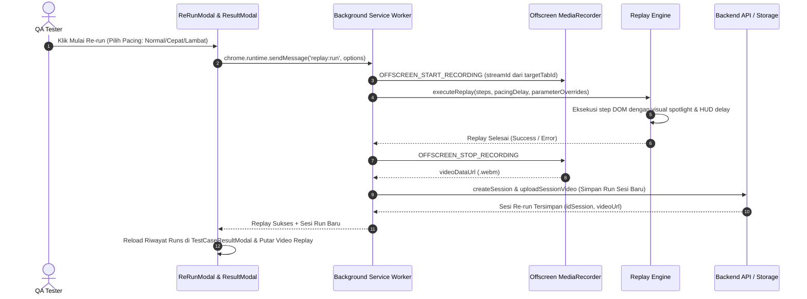

# PRD: Re-run Video Recording, Historical Runs, & Project Table Action Dropdown

**Status:** Planned / Approved  
**Slug:** `rerun-video-history-and-table-ux`  
**Author:** Knitto QA & Dev Team  
**Date:** 2026-09-26  

---

## 1. Problem Statement & Motivation

1. **Re-run Belum Menghasilkan Bukti Video:**
   Saat tester menjalankan fitur *Re-run* (otomasi Playwright replay di browser), proses saat ini hanya mengeksekusi step DOM dan menampilkan visual HUD di halaman tab, tetapi tidak merekam stream tab menjadi file video `.webm` seperti halnya saat proses perekaman manual awal. Akibatnya, tester tidak memiliki bukti video dari hasil uji ulang (re-run).

2. **Eksekusi Script Terlalu Cepat (Pacing/Delay Issue):**
   Eksekusi script replay yang berjalan tanpa pacing/delay yang terukur akan tampak sangat cepat dan berpotensi membuat rekaman video menjadi glitchy atau sulit dievaluasi secara visual. Diperlukan opsi pengaturan kecepatan replay (*Normal*, *Cepat*, *Lambat/Debug*).

3. **Belum Ada Riwayat Multi-Run (Historical Re-run) untuk Quick Record & Project:**
   Ketika skenario Quick Record maupun Project Test Case dijalankan ulang berkali-kali (dengan parameter override yang berbeda-beda), hasil re-run belum terdokumentasi dalam daftar *Historical Runs* yang dapat dipilih dan dibandingkan videonya di dalam modal hasil.

4. **Tabel Test Case Terlalu Penuh & Cluttered:**
   Di tabel spreadsheet test case pada `ProjectView`, tombol aksi (Rekam, Hasil, Edit, Hapus) saat ini berjejer menyamping. Ini memakan ruang horizontal yang lebar. Diperlukan tombol compact dropdown `⋮` (More Action) dan interaktivitas klik baris langsung.

---

## 2. Scope & Key Decisions

### A. Re-run Video Capture & Pacing Engine
- **Opsi Kecepatan di Re-Run Modal:**
  - `Normal` (Default: ~800ms pause antar step): Memberikan jeda visual spotlight alami, sangat ideal untuk tab video capture.
  - `Cepat` (~300ms pause antar step): Untuk eksekusi cepat.
  - `Lambat / Debug` (~1500ms pause antar step): Untuk observasi mendalam langkah per langkah.
- **Perekaman Video Otomatis Saat Re-run:**
  - Saat `executeReplay` dimulai, background Service Worker memanggil `_startTabVideoRecording(targetTabId)` melalui Offscreen MediaRecorder.
  - Saat replay selesai atau gagal, background memanggil `_stopTabVideoRecording()` dan mengunggah video WebM ke storage/backend API.
  - Hasil replay membuat entri sesi rekaman baru bertipe rerun (misal `[Re-run] <TestCaseNo>`) yang menyimpan `video_url`, status akhir (`PASSED`/`FAILED`), dan log eksekusi.

### B. Historical Runs Navigator di TestCaseResultModal
- Di dalam `TestCaseResultModal`, ditambahkan komponen **"Riwayat Eksekusi (Runs)"** (dropdown / run selector).
- Tester dapat berpindah antara:
  - **Run #1 (Original Recording):** Tanggal, Status, Video WebM Asli, Checkpoints.
  - **Run #2 (Re-run 1):** Tanggal, Status (`PASSED`/`FAILED`), Video WebM Replay, Parameter Overrides.
  - **Run #3 (Re-run 2):** dst...
- Bekerja mulus untuk skenario Quick Record (tanpa project) maupun Project Test Case.

### C. Compact Action Dropdown di Tabel Test Case Project
- Menggantikan jejeran 4 tombol aksi dengan 1 tombol icon `⋮` (`MoreVertical`).
- Mengklik tombol memunculkan dropdown menu yang memuat:
  1. 🟢 **Mulai Rekam** (`Play`)
  2. 👁️ **Lihat Hasil & Video** (`Eye`, muncul jika test case memiliki hasil)
  3. 🔁 **Re-run Cepat** (`Repeat`, jika sudah memiliki script)
  4. ✏️ **Edit Test Case** (`Edit`)
  5. 🗑️ **Hapus Test Case** (`Trash2`)
- Dilengkapi penanganan *click outside* dan `e.stopPropagation()` agar tidak memicu klik baris.

### D. Interaktivitas Klik Baris (Row Click)
- **Baris yang sudah memiliki hasil (`last_session_id` atau status selesai):** Klik pada baris langsung membuka `TestCaseResultModal`.
- **Baris yang belum memiliki hasil:** Klik pada baris membuka form modal `Edit Test Case`.
- Hover efek yang jelas (`cursor: pointer`, highlight background) untuk menandakan baris interaktif.

---

## 3. Architecture & Data Flow

---

## 4. Out of Scope
- Editing video pasca-perekaman (misal trim atau add watermark).
- Re-run paralel multi-mesin di luar browser extension (misal Playwright Grid eksternal).
